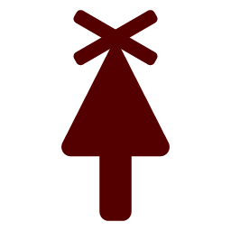
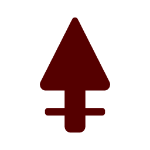
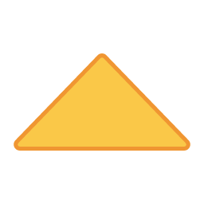
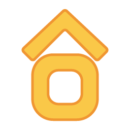
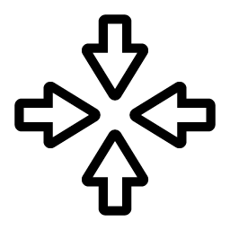
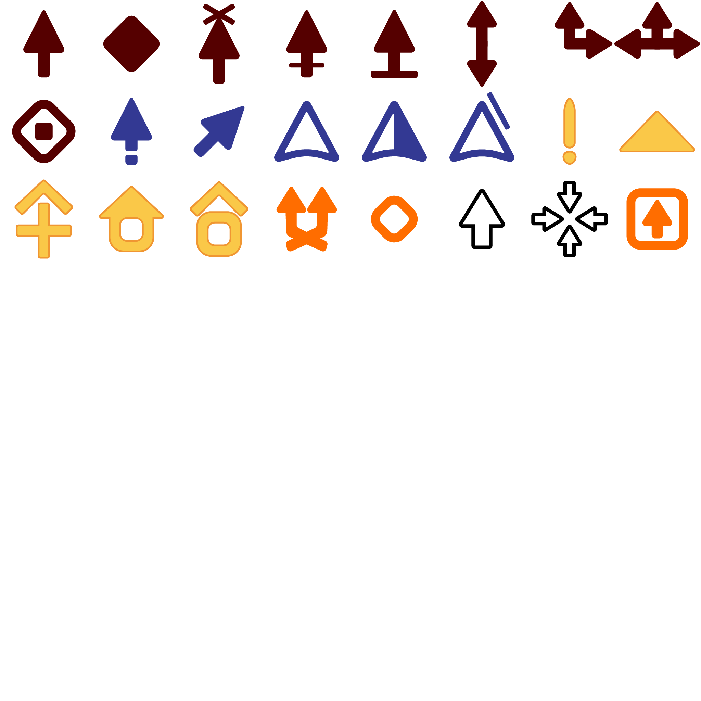

This is the Logic Arrows specification written by Sag Drip. It contains descriptions of basic game concepts and their implementation in pseudo-code.

This is the first edition of the specification, designed based on Logic Arrows v1.2. This standard will be updated for every major and minor version update pf the official game.

### Table of contents

- [Introduction](#introduction)
- [Game](#game)
- [Signals](#signals)
- [Arrows](#arrows)
- [Map](#map)
  - [Loading](#loading)
  - [Saving](#saving)
- [Arrow types](#arrow-types)
    - [Void](#void)
  - [Red arrows](#red-arrows)
    - [Arrow](#arrow)
    - [Source block](#source-block)
    - [Blocker](#blocker)
    - [Delay arrow](#delay-arrow)
    - [Signal detector](#signal-detector)
    - [Up-down splitter](#up-down-splitter)
    - [Up-right splitter](#up-right-splitter)
    - [Up-left-right splitter](#up-left-right-splitter)
    - [Pulse generator](#pulse-generator)
  - [Blue arrows](#blue-arrows)
    - [Blue arrow](#blue-arrow)
    - [Diagonal arrow](#diagonal-arrow)
    - [Up-up blue splitter](#up-up-blue-splitter)
    - [Up-right blue splitter](#up-right-blue-splitter)
    - [Up-diagonal blue splitter](#up-diagonal-blue-splitter)
  - [Yellow arrows](#yellow-arrows)
    - [Not gate](#not-gate)
    - [And gate](#and-gate)
    - [XOR gate](#xor-gate)
    - [Latch](#latch)
    - [T flip-flop](#t-flip-flop)
  - [Orange arrows](#orange-arrows)
    - [Randomizer](#randomizer)
    - [Button](#button)
    - [Directional button](#directional-button)
  - [Level arrows](#level-arrows)
    - [Source](#source)
    - [Target](#target)
- [Updating](#updating)
- [Rendering](#rendering)

# Introduction

[Logic Arrows](https://logic-arrows.io) is a cellular-automata-like sandbox game created by [Onigiri](https://www.youtube.com/@OnigiriScience).

This specifications covers arrow and signal types, map save formats and some other basic concepts. It is intended for making custom Logic Arrows ports.

# Game

The game operates on an infinite square grid. Each cell contains an arrow that changes its signal color based on neighbour cells' states or external input and sends or blocks signals around it. Logic Arrows use von Neumann neighbourhood of range 2. A step, when the state of each arrow on the grid updates, is called a tick. Speed of light is the maximum possible distance that a signal can travel in one tick, being 2 cells. Each cell is defined by XY coordinates, with `(0, 0)` being the center of the map. X is increasing from left to right, Y is increasing from top to bottom.

There are four directions of arrows: north (up), east (right), south (down), west (left).
**Pseudo-code**:
```cpp
enum direction(north,
               east,
               south,
               west)
```

# Signals

Signals represent states that can be managed by the arrows themselves. Each signal is represented by a color.

| Name    | HEX       | RGB                    | vec4                       |
| ------- | --------- | ---------------------- | -------------------------- |
| White   | `#ffffff` | `rgb(255, 255, 255)` | `vec4(1.0, 1.0, 1.0, 1.0)` |
| Red     | `#ff0000` | `rgb(255, 0, 0)`     | `vec4(1.0, 0.0, 0.0, 1.0)` |
| Blue    | `#4c7fff` | `rgb(76, 127, 255)`  | `vec4(0.3, 0.5, 1.0, 1.0)` |
| Yellow  | `#ffff00` | `rgb(255, 255, 0)`   | `vec4(1.0, 1.0, 0.0, 1.0)` |
| Green   | `#00cc00` | `rgb(0, 204, 0)`     | `vec4(0.0, 0.8, 0.0, 1.0)` |
| Orange  | `#ffcc33` | `rgb(255, 204, 51)`  | `vec4(1.0, 0.8, 0.2, 1.0)` |
| Magenta | `#ff33ff` | `rgb(255, 51, 255)`  | `vec4(1.0, 0.2, 1.0, 1.0)` |

**Pseudo-code**:
```cpp
enum signal(white,
            red,
            blue,
            yellow,
            green,
            orange,
            magenta)
```

# Arrows

Each arrow has constant and current state. Constant state defines arrow's type, rotation and flip flag. Arrow type specifies its behaviour and used texture, rotation and flip flag specifies its orientation and direction. Each arrow can change its signal color and send/block signals relative to its position on the grid.

**Pseudo-code**:
```cpp
struct state {
    signal signal = signal(white);
    int signalCount = 0;
    bool blocked = false;
}

struct arrow {
    int type = 0;
    direction rotation = direction(north);
    bool flipped = false;
}
```

# Map

Map is an actual representation of the game grid. Map is split up in chunks to make it possible to store infinite grids. Each chunk is exactly 16x16 cells. Chunks are defined by their XY chunk position. Chunk position is equal to the integer quotient of arrow position by chunk size.

Map saves are stored as base64 strings of binary save data.

## Loading

```cpp
int readU8(bytes buf) {
    int value = buf.pop();
    return value;
}

int readU16(bytes buf) {
    int low = readU8(buf);
    int high = readU8(buf);
    return (high << 8) | low;
}

int readS16(bytes buf) {
    int value = readU16();
    if (value & 0x8000 == 1)
        value = -(value & 0x7FFF);
    return value;
}

void load(map map, bytes buf) {
    if (buf.size < 4) return;

    if (readU16(buf) != 0)
        error("Unsupported save version");

    int chunkCount = readU16(buf);
    for (0 .. chunkCount) {
        int chunkX = readS16(buf);
        int chunkY = readS16(buf);

        chunk chunk = getChunk(chunkX, chunkY);

        int arrowTypeCount = readU8(buf) + 1;
        for (0 .. arrowTypeCount) {
            int type = readU8(buf);

            int arrowCount = readU8(buf);
            for (0 .. arrowCount) {
                int position = readU8(buf);
                int rotation = readU8(buf);
                chunk.setArrow(position & 0xF, position >> 4, arrow(type=type, rotation=rotation & 0x3, flipped=rotation & 0x4));
            }
        }
    }
}
```

## Saving

```cpp
int writeU8(bytes buf, int value) {
    buf.push(value);
}

int writeU16(bytes buf, int value) {
    int high = value >> 8;
    int low = value & 0xFF;
    writeU8(low);
    writeU8(high);
}

int writeS16(bytes buf, int value) {
    if (value < 0)
        value = -value | 0x8000;
    writeU16(value);
}

void save(map map, bytes buf) {
    writeU16(buf, 0);

    writeU16(buf, map.chunkCount);
    for (chunk chunk : map) {
        writeS16(buf, chunk.x);
        writeS16(buf, chunk.y);

        list<int> types = chunk.getUniqueArrowTypes();
        writeU8(buf, types.size - 1);
        for (int type : types) {
            writeU8(type);

            list<arrow> arrows = chunk.getArrowsByType();
            writeU8(arrows.size - 1);
            for (arrow arrow : arrows) {
                writeU8((arrow.y << 4) | arrow.x);
                writeU8((arrow.flipped << 3) | arrow.rotation);
            }
        }
    }
}
```

# Arrow types

Arrow types are grouped in arrow classes. Arrow types of the same class have similar properties. There are 5 arrow classes.

### Void

**ID**: 0

Represents an empty cell.

## Red arrows

This class consists of simple arrows that emit signals in von Neumann neighbourhood of range 1.

### Arrow


**ID**: 1

**Activation rule**: If received signal count is greater than 0, change the signal color to `Red`. Otherwise, change the signal color to `White`.

**Signal transmission**: If the current signal color is `Red`, send signal to `(0, -1)`.

**Pseudo-code**:
```cpp
void activate(chunk chunk, arrow arrow, int x, int y, state curr, state prev, int step, int nextStep) {
    curr.signal = curr.signalCount > 0 ? signal(red) : signal(white);
}

void transmit(chunk chunk, arrow arrow, int x, int y, state curr, state prev, int step, int nextStep) {
    if (curr.signal == signal(red))
        sendSignal(getArrowRelative(chunk, arrow, x, y, 0, -1), nextStep);
}
```

### Source block


**ID**: 2

**Activation rule**: Always change the signal color to `Red`.

**Signal transmission**: If the current signal color is `Red`, send signal to `(0, -1)`, `(1, 0)`, `(0, 1)`, `(-1, 0)`.

**Pseudo-code**:
```cpp
void activate(chunk chunk, arrow arrow, int x, int y, state curr, state prev, int step, int nextStep) {
    curr.signal = signal(red);
}

void transmit(chunk chunk, arrow arrow, int x, int y, state curr, state prev, int step, int nextStep) {
    if (curr.signal == signal(red)) {
        sendSignal(getArrowRelative(chunk, arrow, x, y,  0, -1), nextStep);
        sendSignal(getArrowRelative(chunk, arrow, x, y,  1,  0), nextStep);
        sendSignal(getArrowRelative(chunk, arrow, x, y,  0,  1), nextStep);
        sendSignal(getArrowRelative(chunk, arrow, x, y, -1,  0), nextStep);
    }
}
```

### Blocker



**ID**: 3

**Activation rule**: If received signal count is greater than 0, change the signal color to `Red`. Otherwise, change the signal color to `White`.

**Signal transmission**: If the current signal color is `Red`, block signal at `(0, -1)`.

**Pseudo-code**:
```cpp
void activate(chunk chunk, arrow arrow, int x, int y, state curr, state prev, int step, int nextStep) {
    curr.signal = curr.signalCount > 0 ? signal(red) : signal(white);
}

void transmit(chunk chunk, arrow arrow, int x, int y, state curr, state prev, int step, int nextStep) {
    if (curr.signal == signal(red))
        blockSignal(getArrowRelative(chunk, arrow, x, y, 0, -1), nextStep);
}
```

### Delay arrow



**ID**: 4

**Activation rule**: If the previous signal color is `Blue` or if the previous signal color is `Red` and received signal count is greater then 0, change the signal color to `Red`. Else, if received signal count is greater than 0, change the signal color to `Blue`. Otherwise, change the signal color to `White`.

**Signal transmission**: If the current signal color is `Red`, send signal to `(0, -1)`.

**Pseudo-code**:
```cpp
void activate(chunk chunk, arrow arrow, int x, int y, state curr, state prev, int step, int nextStep) {
    if (prev.signal == signal(blue) || (prev.signal == signal(red) && curr.signalCount > 0))
        curr.signal = signal(red);
    else if (curr.signalCount > 0)
        curr.signal = signal(blue);
    else
        curr.signal = signal(white);
}

void transmit(chunk chunk, arrow arrow, int x, int y, state curr, state prev, int step, int nextStep) {
    if (curr.signal == signal(red))
        sendSignal(getArrowRelative(chunk, arrow, x, y, 0, -1), nextStep);
}
```

### Signal detector


**ID**: 5

**Activation rule**: If the previous signal color of the arrow behind is not `White`, change the signal color to `Red`. Otherwise, change the signal color to `White`.

**Signal transmission**: If the current signal color is `Red`, send signal to `(0, -1)`.

**Pseudo-code**:
```cpp
void activate(chunk chunk, arrow arrow, int x, int y, state curr, state prev, int step, int nextStep) {
    arrow arrowBehind = getArrowRelative(chunk, arrow, x, y, 0, 1);
    curr.signal = arrowBehind != null && getArrowState(arrowBehind, nextStep).signal != signal(white) ? signal(red) : signal(white);
}

void transmit(chunk chunk, arrow arrow, int x, int y, state curr, state prev, int step, int nextStep) {
    if (curr.signal == signal(red))
        sendSignal(getArrowRelative(chunk, arrow, x, y, 0, -1), nextStep);
}
```

### Up-down splitter


**ID**: 6

**Activation rule**: If received signal count is greater than 0, change the signal color to `Red`. Otherwise, change the signal color to `White`.

**Signal transmission**: If the current signal color is `Red`, send signal to `(0, -1)`, `(0, 1)`.

**Pseudo-code**:
```cpp
void activate(chunk chunk, arrow arrow, int x, int y, state curr, state prev, int step, int nextStep) {
    curr.signal = curr.signalCount > 0 ? signal(red) : signal(white);
}

void transmit(chunk chunk, arrow arrow, int x, int y, state curr, state prev, int step, int nextStep) {
    if (curr.signal == signal(red)) {
        sendSignal(getArrowRelative(chunk, arrow, x, y, 0, -1), nextStep);
        sendSignal(getArrowRelative(chunk, arrow, x, y, 0,  1), nextStep);
    }
}
```

### Up-right splitter


**ID**: 7

**Activation rule**: If received signal count is greater than 0, change the signal color to `Red`. Otherwise, change the signal color to `White`.

**Signal transmission**: If the current signal color is `Red`, send signal to `(0, -1)`, `(1, 0)`.

**Pseudo-code**:
```cpp
void activate(chunk chunk, arrow arrow, int x, int y, state curr, state prev, int step, int nextStep) {
    curr.signal = curr.signalCount > 0 ? signal(red) : signal(white);
}

void transmit(chunk chunk, arrow arrow, int x, int y, state curr, state prev, int step, int nextStep) {
    if (curr.signal == signal(red)) {
        sendSignal(getArrowRelative(chunk, arrow, x, y, 0, -1), nextStep);
        sendSignal(getArrowRelative(chunk, arrow, x, y, 1,  0), nextStep);
    }
}
```

### Up-left-right splitter


**ID**: 8

**Activation rule**: If received signal count is greater than 0, change the signal color to `Red`. Otherwise, change the signal color to `White`.

**Signal transmission**: If the current signal color is `Red`, send signal to `(0, -1)`, `(-1, 0)`, `(1, 0)`.

**Pseudo-code**:
```cpp
void activate(chunk chunk, arrow arrow, int x, int y, state curr, state prev, int step, int nextStep) {
    curr.signal = curr.signalCount > 0 ? signal(red) : signal(white);
}

void transmit(chunk chunk, arrow arrow, int x, int y, state curr, state prev, int step, int nextStep) {
    if (curr.signal == signal(red)) {
        sendSignal(getArrowRelative(chunk, arrow, x, y,  0, -1), nextStep);
        sendSignal(getArrowRelative(chunk, arrow, x, y, -1,  0), nextStep);
        sendSignal(getArrowRelative(chunk, arrow, x, y,  1,  0), nextStep);
    }
}
```

### Pulse generator


**ID**: 9

**Activation rule**: If the previous signal color is `White`, change the signal color to `Red`. Otherwise, change the signal color to `Blue`.

**Signal transmission**: If the current signal color is `Red`, send signal to `(0, -1)`, `(1, 0)`, `(0, 1)`, `(-1, 0)`.

**Pseudo-code**:
```cpp
void activate(chunk chunk, arrow arrow, int x, int y, state curr, state prev, int step, int nextStep) {
    curr.signal = prev.signal == signal(white) ? signal(red) : signal(blue);
}

void transmit(chunk chunk, arrow arrow, int x, int y, state curr, state prev, int step, int nextStep) {
    if (curr.signal == signal(red)) {
        sendSignal(getArrowRelative(chunk, arrow, x, y,  0, -1), nextStep);
        sendSignal(getArrowRelative(chunk, arrow, x, y,  1,  0), nextStep);
        sendSignal(getArrowRelative(chunk, arrow, x, y,  0,  1), nextStep);
        sendSignal(getArrowRelative(chunk, arrow, x, y, -1,  0), nextStep);
    }
}
```

## Blue arrows

Arrows of this class don't have special activation rules, they transmit signals at the speed of light.

### Blue arrow


**ID**: 10

**Activation rule**: If received signal count is greater than 0, change the signal color to `Blue`. Otherwise, change the signal color to `White`.

**Signal transmission**: If the current signal color is `Blue`, send signal to `(0, -2)`.

**Pseudo-code**:
```cpp
void activate(chunk chunk, arrow arrow, int x, int y, state curr, state prev, int step, int nextStep) {
    curr.signal = curr.signalCount > 0 ? signal(blue) : signal(white);
}

void transmit(chunk chunk, arrow arrow, int x, int y, state curr, state prev, int step, int nextStep) {
    if (curr.signal == signal(blue))
        sendSignal(getArrowRelative(chunk, arrow, x, y, 0, -2), nextStep);
}
```

### Diagonal arrow


**ID**: 11

**Activation rule**: If received signal count is greater than 0, change the signal color to `Blue`. Otherwise, change the signal color to `White`.

**Signal transmission**: If the current signal color is `Blue`, send signal to `(1, -1)`.

**Pseudo-code**:
```cpp
void activate(chunk chunk, arrow arrow, int x, int y, state curr, state prev, int step, int nextStep) {
    curr.signal = curr.signalCount > 0 ? signal(blue) : signal(white);
}

void transmit(chunk chunk, arrow arrow, int x, int y, state curr, state prev, int step, int nextStep) {
    if (curr.signal == signal(blue))
        sendSignal(getArrowRelative(chunk, arrow, x, y, 1, -1), nextStep);
}
```

### Up-up blue splitter


**ID**: 12

**Activation rule**: If received signal count is greater than 0, change the signal color to `Blue`. Otherwise, change the signal color to `White`.

**Signal transmission**: If the current signal color is `Blue`, send signal to `(0, -1)`, `(0, -2)`.

**Pseudo-code**:
```cpp
void activate(chunk chunk, arrow arrow, int x, int y, state curr, state prev, int step, int nextStep) {
    curr.signal = curr.signalCount > 0 ? signal(blue) : signal(white);
}

void transmit(chunk chunk, arrow arrow, int x, int y, state curr, state prev, int step, int nextStep) {
    if (curr.signal == signal(blue)) {
        sendSignal(getArrowRelative(chunk, arrow, x, y, 0, -1), nextStep);
        sendSignal(getArrowRelative(chunk, arrow, x, y, 0, -2), nextStep);
    }
}
```

### Up-right blue splitter


**ID**: 13

**Activation rule**: If received signal count is greater than 0, change the signal color to `Blue`. Otherwise, change the signal color to `White`.

**Signal transmission**: If the current signal color is `Blue`, send signal to `(0, -2)`, `(1, 0)`.

**Pseudo-code**:
```cpp
void activate(chunk chunk, arrow arrow, int x, int y, state curr, state prev, int step, int nextStep) {
    curr.signal = curr.signalCount > 0 ? signal(blue) : signal(white);
}

void transmit(chunk chunk, arrow arrow, int x, int y, state curr, state prev, int step, int nextStep) {
    if (curr.signal == signal(blue)) {
        sendSignal(getArrowRelative(chunk, arrow, x, y, 0, -2), nextStep);
        sendSignal(getArrowRelative(chunk, arrow, x, y, 1,  0), nextStep);
    }
}
```

### Up-diagonal blue splitter


**ID**: 14

**Activation rule**: If received signal count is greater than 0, change the signal color to `Blue`. Otherwise, change the signal color to `White`.

**Signal transmission**: If the current signal color is `Blue`, send signal to `(0, -1)`, `(1, -1)`.

**Pseudo-code**:
```cpp
void activate(chunk chunk, arrow arrow, int x, int y, state curr, state prev, int step, int nextStep) {
    curr.signal = curr.signalCount > 0 ? signal(blue) : signal(white);
}

void transmit(chunk chunk, arrow arrow, int x, int y, state curr, state prev, int step, int nextStep) {
    if (curr.signal == signal(blue)) {
        sendSignal(getArrowRelative(chunk, arrow, x, y, 0, -1), nextStep);
        sendSignal(getArrowRelative(chunk, arrow, x, y, 1, -1), nextStep);
    }
}
```

## Yellow arrows

This class represents logic gates. They send signal forwards, whenever they are active.

### Not gate


**ID**: 15

**Activation rule**: If received signal count is equal to 0, change the signal color to `Yellow`. Otherwise, change the signal color to `White`.

**Signal transmission**: If the current signal color is `Yellow`, send signal to `(0, -1)`.

**Pseudo-code**:
```cpp
void activate(chunk chunk, arrow arrow, int x, int y, state curr, state prev, int step, int nextStep) {
    curr.signal = curr.signalCount == 0 ? signal(yellow) : signal(white);
}

void transmit(chunk chunk, arrow arrow, int x, int y, state curr, state prev, int step, int nextStep) {
    if (curr.signal == signal(yellow))
        sendSignal(getArrowRelative(chunk, arrow, x, y, 0, -1), nextStep);
}
```

### And gate



**ID**: 16

**Activation rule**: If received signal count is greater than or equal to 2, change the signal color to `Yellow`. Otherwise, change the signal color to `White`.

**Signal transmission**: If the current signal color is `Yellow`, send signal to `(0, -1)`.

**Pseudo-code**:
```cpp
void activate(chunk chunk, arrow arrow, int x, int y, state curr, state prev, int step, int nextStep) {
    curr.signal = curr.signalCount >= 2 ? signal(yellow) : signal(white);
}

void transmit(chunk chunk, arrow arrow, int x, int y, state curr, state prev, int step, int nextStep) {
    if (curr.signal == signal(yellow))
        sendSignal(getArrowRelative(chunk, arrow, x, y, 0, -1), nextStep);
}
```

### XOR gate


**ID**: 17

**Activation rule**: If received signal count is an odd number, change the signal color to `Yellow`. Otherwise, change the signal color to `White`.

**Signal transmission**: If the current signal color is `Yellow`, send signal to `(0, -1)`.

**Pseudo-code**:
```cpp
void activate(chunk chunk, arrow arrow, int x, int y, state curr, state prev, int step, int nextStep) {
    curr.signal = curr.signalCount % 2 == 1 ? signal(yellow) : signal(white);
}

void transmit(chunk chunk, arrow arrow, int x, int y, state curr, state prev, int step, int nextStep) {
    if (curr.signal == signal(yellow))
        sendSignal(getArrowRelative(chunk, arrow, x, y, 0, -1), nextStep);
}
```

### Latch


**ID**: 18

**Activation rule**: If received signal count is greater than 0, change the signal color to `White` if it's less than 2, else to change it to `Yellow`. Otherwise, change the signal color to the previous signal color.

**Signal transmission**: If the current signal color is `Yellow`, send signal to `(0, -1)`.

**Pseudo-code**:
```cpp
void activate(chunk chunk, arrow arrow, int x, int y, state curr, state prev, int step, int nextStep) {
    if (curr.signalCount > 0)
        curr.signal = curr.signalColor >= 2 ? signal(yellow) : signal(white);
    else
        curr.signal = prev.signal;
}

void transmit(chunk chunk, arrow arrow, int x, int y, state curr, state prev, int step, int nextStep) {
    if (curr.signal == signal(yellow))
        sendSignal(getArrowRelative(chunk, arrow, x, y, 0, -1), nextStep);
}
```

### T flip-flop



**ID**: 19

**Activation rule**: If received signal count is greater than 0, change the signal color to opposite of the previous (`Yellow` - `White`). Otherwise, change the signal color to the previous signal color.

**Signal transmission**: If the current signal color is `Yellow`, send signal to `(0, -1)`.

**Pseudo-code**:
```cpp
void activate(chunk chunk, arrow arrow, int x, int y, state curr, state prev, int step, int nextStep) {
    if (curr.signalCount > 0)
        curr.signal = prev.signal == signal(white) ? signal(yellow) : signal(white);
    else
        curr.signal = prev.signal;
}

void transmit(chunk chunk, arrow arrow, int x, int y, state curr, state prev, int step, int nextStep) {
    if (curr.signal == signal(yellow))
        sendSignal(getArrowRelative(chunk, arrow, x, y, 0, -1), nextStep);
}
```

## Orange arrows

Arrows of this class can receive external input from the game.

### Randomizer


**ID**: 20

**Activation rule**: If received signal count is greater than 0, randomly change the signal color to either `Orange` or `White`. Otherwise, change the signal color to `White`.

**Signal transmission**: If the current signal color is `Orange`, send signal to `(0, -1)`.

**Pseudo-code**:
```cpp
void activate(chunk chunk, arrow arrow, int x, int y, state curr, state prev, int step, int nextStep) {
    if (curr.signalCount > 0)
        curr.signal = random(signal(orange), signal(white));
    else
        curr.signal = signal(white);
}

void transmit(chunk chunk, arrow arrow, int x, int y, state curr, state prev, int step, int nextStep) {
    if (curr.signal == signal(orange))
        sendSignal(getArrowRelative(chunk, arrow, x, y, 0, -1), nextStep);
}
```

### Button


**ID**: 21

**Activation rule**: If the arrow is currently pressed, change the signal color to `Orange`. Otherwise, change the signal color to `White`.

**Signal transmission**: If the current signal color is `Orange`, send signal to `(0, -1)`, `(1, 0)`, `(0, 1)`, `(-1, 0)`.

**Pseudo-code**:
```cpp
void activate(chunk chunk, arrow arrow, int x, int y, state curr, state prev, int step, int nextStep) {
    curr.signal = isArrowPressed(arrow) ? signal(orange) : signal(white);
}

void transmit(chunk chunk, arrow arrow, int x, int y, state curr, state prev, int step, int nextStep) {
    if (curr.signal == signal(orange)) {
        sendSignal(getArrowRelative(chunk, arrow, x, y,  0, -1), nextStep);
        sendSignal(getArrowRelative(chunk, arrow, x, y,  1,  0), nextStep);
        sendSignal(getArrowRelative(chunk, arrow, x, y,  0,  1), nextStep);
        sendSignal(getArrowRelative(chunk, arrow, x, y, -1,  0), nextStep);
    }
}
```

### Directional button


**ID**: 24

**Activation rule**: If received signal count is greater than 0 or if the arrow is currently pressed, change the signal color to `Orange`. Otherwise, change the signal color to `White`.

**Signal transmission**: If the current signal color is `Orange`, send signal to `(0, -1)`.

**Pseudo-code**:
```cpp
void activate(chunk chunk, arrow arrow, int x, int y, state curr, state prev, int step, int nextStep) {
    curr.signal = curr.signalCount > 0 || isArrowPressed(arrow) ? signal(orange) : signal(white);
}

void transmit(chunk chunk, arrow arrow, int x, int y, state curr, state prev, int step, int nextStep) {
    if (curr.signal == signal(orange))
        sendSignal(getArrowRelative(chunk, arrow, x, y, 0, -1), nextStep);
}
```

## Level arrows

This class is designed to add functionality to levels. It isn't required, but the implementation can still decide to add it.

### Source


**ID**: 22

**Activation rule**: If received signal count is greater than 0 or if the arrow is activated externally, change the signal color to `Red`. Otherwise, change the signal color to `White`.

**Signal transmission**: If the current signal color is `Red`, send signal to `(0, -1)`.

**Pseudo-code**:
```cpp
void activate(chunk chunk, arrow arrow, int x, int y, state curr, state prev, int step, int nextStep) {
    curr.signal = curr.signalCount > 0 || isLeverArrowActive(curr) ? signal(red) : signal(white);
}

void transmit(chunk chunk, arrow arrow, int x, int y, state curr, state prev, int step, int nextStep) {
    if (curr.signal == signal(red))
        sendSignal(getArrowRelative(chunk, arrow, x, y, 0, -1), nextStep);
}
```

### Target



**ID**: 23

**Activation rule**: If received signal count is greater than 0, change the signal color to `Red`. Otherwise, change the signal color to `White`.

**Signal transmission**: If the current signal color is `Red`, send external event.

**Pseudo-code**:
```cpp
void activate(chunk chunk, arrow arrow, int x, int y, state curr, state prev, int step, int nextStep) {
    curr.signal = curr.signalCount > 0 ? signal(red) : signal(white);
}

void transmit(chunk chunk, arrow arrow, int x, int y, state curr, state prev, int step, int nextStep) {
    if (curr.signal == signal(red))
        triggerLevelEvent(arrow);
}
```

# Updating

Updating is the proccess of performing ticks.

Every tick, the game iterates over every arrow in every chunk and calls the required update functions. Then, it performs state swapping (swaps the current state with next).

To find neighbours faster when signals transmit from one chunk to another, the game can store adjacent chunks in an array:
|     |     |     |
| --- | --- | --- |
|  7  |  0  |  1  |
|  6  |  #  |  2  |
|  5  |  4  |  3  |

**Pseudo-code**:
```cpp
void getArrowRelative(chunk chunk, arrow arrow, int x, int y) {
    if (arrow.flipped)
        dx = -dx;
    switch (arrow.rotation) {
        case direction(north):
            y += dy;
            x += dx;
            break;
        case direction(east):
            x -= dy;
            y += dx;
            break;
        case direction(south):
            y -= dy;
            x -= dx;
            break;
        case direction(west):
            x += dy;
            y -= dx;
            break;
    }
    Chunk targetChunk = chunk;
    if (x >= CHUNK_SIZE) {
        if (y >= CHUNK_SIZE) {
            targetChunk = chunk.adjacentChunks[3];
            x -= CHUNK_SIZE;
            y -= CHUNK_SIZE;
      }  else if (y < 0) {
            targetChunk = chunk.adjacentChunks[1];
            x -= CHUNK_SIZE;
            y += CHUNK_SIZE;
        } else {
            targetChunk = chunk.adjacentChunks[2];
            x -= CHUNK_SIZE;
        }
    } else if (x < 0) {
        if (y < 0) {
            targetChunk = chunk.adjacentChunks[7];
            x += CHUNK_SIZE;
            y += CHUNK_SIZE;
        } else if (y >= CHUNK_SIZE) {
            targetChunk = chunk.adjacentChunks[5];
            x += CHUNK_SIZE;
            y -= CHUNK_SIZE;
        } else {
            targetChunk = chunk.adjacentChunks[6];
            x += CHUNK_SIZE;
        }
    } else if (y < 0) {
        targetChunk = chunk.adjacentChunks[0];
        y += CHUNK_SIZE;
    } else if (y >= CHUNK_SIZE) {
        targetChunk = chunk.adjacentChunks[4];
        y -= CHUNK_SIZE;
    }
    return targetChunk == null ? null : targetChunk.getArrow(x, y);
}

void sendSignal(arrow arrow, int step) {
    if (arrow != null && arrow.type != 0)
        getArrowState(arrow, step).signalCount++;
}

void blockSignal(arrow arrow, int step) {
    if (arrow != null && arrow.type != 0)
        getArrowState(arrow, step).blocked = true;
}

void update(map map, int step, int nextStep) {
    for (chunk chunk : map) {
        for (int y = 0 .. 16) {
            for (int x = 0 .. 16) {
                arrow arrow = chunk.getArrow(x, y);
                if (arrow.type != 0) {
                    state curr = getArrowState(arrow, step);
                    state prev = getArrowState(arrow, nextStep);
                    if (curr.blocked) {
                        curr.signal = signal(white);
                    } else {
                        activate(chunk, arrow, x, y, curr, prev, step, nextStep);
                        transmit(chunk, arrow, x, y, curr, prev, step, nextStep);
                    }
                    curr.signalCount = 0;
                    curr.blocked = false;
                }
            }
        }
    }
    swap(step, nextStep);
}
```

# Rendering

Arrow texture are stored in the atlas, with IDs increasing horizontally from 1 to 256:
